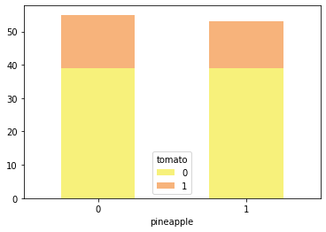

<h1 style="text-align: center;">🍍Pineapples & Tomatoes 🍅</h1> 

**<p style="text-align: center;">Divya Koganti</p>**

## Introduction & The Question

We will be discussing two very controversial questions which are "Does pineapple belong on pizza?" and "Since tomatoes are technically fruits, does that make ketchup jam?"

Both pineapples and tomatoes are technically fruit, yet most people would not classify tomatoes as a fruit when used in recipes. Many argue against the controversial question "does pineapple belong on pizza?" by saying that fruit does not belong on pizza. Others in turn will argue that since tomatoes are technically fruit and tomatoes are required on pizza. Jam by definition is made by fruit so jam could technically be made with tomatoes. 

**The Question**: If someone agrees that ketchup is jam does that relate to if someone agrees that pineapple belongs on pizza?

The null hypothesis is there is no relation between whether someone agrees that ketchup is jam and whether if someone agrees that pineapple belongs on pizza.
The alternative hypothesis is there is a relation between whether someone agrees that ketchup is jam and whether if someone agrees that pineapple belongs on pizza.

My hypothesis is considering ketchup as jam is related agreeing pineapple belongs on pizza because people who are more open to consider tomatoes as fruits when used in recipes such as jam will make it easier to accept a fruit on pizza. 

We will use the data from the M&T intern survey


## Data Cleaning

We will start out by importing the required packages. Then reading in the data from the csv file. We will only need to look at two columns of the data so we remove the other columns. We also rename the column names to tomato and pineapple to make easy to refer to


```python
import pandas as pd
import scipy.stats as stats
import numpy as np
import matplotlib.pyplot as plt
import seaborn as sns
```


```python
df = pd.read_csv('data.csv')
df = df.iloc[:,12:14]
df.rename(columns= {'Since tomatoes are technically fruits, does that make ketchup jam?': 'tomato', 'Does pineapple belong on pizza?': 'pineapple'},inplace=True)
df


```


<div>
<style scoped>
    .dataframe tbody tr th:only-of-type {
        vertical-align: middle;
    }

    .dataframe tbody tr th {
        vertical-align: top;
    }

    .dataframe thead th {
        text-align: right;
    }
</style>
<table border="1" class="dataframe">
  <thead>
    <tr style="text-align: right;">
      <th></th>
      <th>tomato</th>
      <th>pineapple</th>
    </tr>
  </thead>
  <tbody>
    <tr>
      <th>0</th>
      <td>0</td>
      <td>0</td>
    </tr>
    <tr>
      <th>1</th>
      <td>0</td>
      <td>0</td>
    </tr>
    <tr>
      <th>2</th>
      <td>0</td>
      <td>1</td>
    </tr>
    <tr>
      <th>3</th>
      <td>0</td>
      <td>1</td>
    </tr>
    <tr>
      <th>4</th>
      <td>1</td>
      <td>0</td>
    </tr>
    <tr>
      <th>...</th>
      <td>...</td>
      <td>...</td>
    </tr>
    <tr>
      <th>103</th>
      <td>0</td>
      <td>0</td>
    </tr>
    <tr>
      <th>104</th>
      <td>0</td>
      <td>0</td>
    </tr>
    <tr>
      <th>105</th>
      <td>0</td>
      <td>1</td>
    </tr>
    <tr>
      <th>106</th>
      <td>0</td>
      <td>0</td>
    </tr>
    <tr>
      <th>107</th>
      <td>0</td>
      <td>0</td>
    </tr>
  </tbody>
</table>
<p>108 rows × 2 columns</p>
</div>


## Exploratory Analysis & Data Visualization 
We will be using the Chi-Square Test of Independence which shows if two categorical variables are related in this case whether you said yes or no with the two questions at hand. We need to first create a contingency table which is a frequency table of two categorical variables.


```python
observed = pd.crosstab(df['pineapple'],df['tomato'])
observed


```


<div>
<style scoped>
    .dataframe tbody tr th:only-of-type {
        vertical-align: middle;
    }

    .dataframe tbody tr th {
        vertical-align: top;
    }

    .dataframe thead th {
        text-align: right;
    }
</style>
<table border="1" class="dataframe">
  <thead>
    <tr style="text-align: right;">
      <th>tomato</th>
      <th>0</th>
      <th>1</th>
    </tr>
    <tr>
      <th>pineapple</th>
      <th></th>
      <th></th>
    </tr>
  </thead>
  <tbody>
    <tr>
      <th>0</th>
      <td>39</td>
      <td>16</td>
    </tr>
    <tr>
      <th>1</th>
      <td>39</td>
      <td>14</td>
    </tr>
  </tbody>
</table>
</div>


```python
barplot = observed.plot(kind="bar", stacked=True, rot=0,color=['#f7f17b','#f7b37b'])

```


    

    


Visualized the contigency table

We now can run Chi-Square Test of Independence


```python
stats.chi2_contingency(observed)

```


    (0.009119936667106414,
     0.9239189932360474,
     1,
     array([[39.72222222, 15.27777778],
            [38.27777778, 14.72222222]]))


The second value is the p-value and the p-value is 0.92 which is greater than the typical alpha value 0.05 which means we fail to reject the null hypothesis. That means there is no relation between the two variables. 

## Conclusions
Many despise pineapple on pizza because many feel fruit does not belong on pizza and in turn I thought if someone believes tomato is classified as a fruit in recipes like jam, they would be okay with pineapple on pizza. With our statistical finding this turns out to be wrong. This might the case since there many reasons why someone may think pineapple does not belong on pizza like the sweet and savory combo.

P.S. Pineapple does belong on pizza and ketchup is a jelly not jam

## Submission
1. Who am I? I am Divya Koganti, a rising senior at University of Maryland where I am studying computer science. I am a tech intern at Wilmington
2. I have an explicit question: If someone agrees that ketchup is jam does that relate to if someone agrees that pineapple belongs on pizza?
In which I used code, statistics and visuals to come to the conclusion that the two responses to the questions are not related
3. I went above and beyond by going to into depth the data science behind the answer
